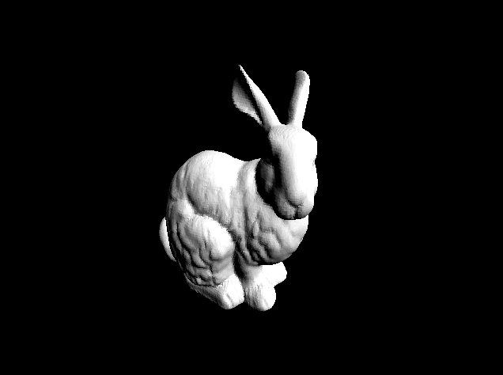
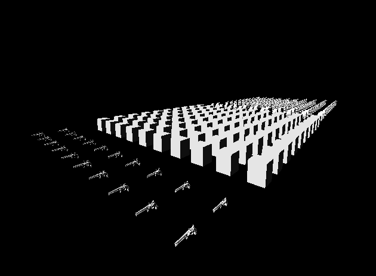
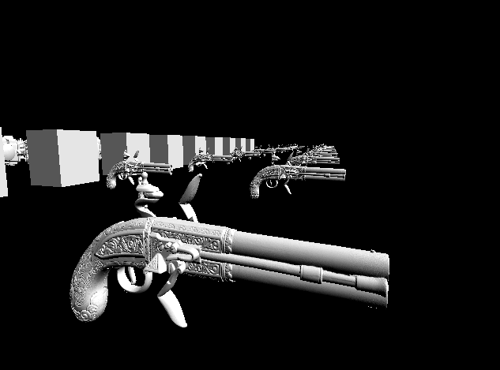
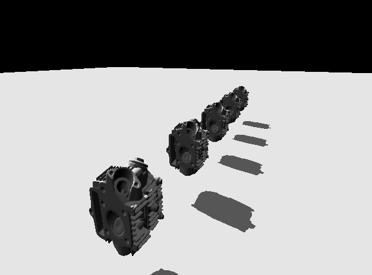
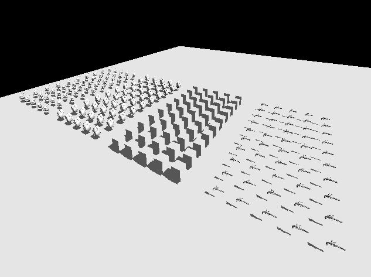

# Движок для отрисовки мешей

Install SDL:
```
sudo apt-get install libsdl2-2.0-0
sudo apt-get install libsdl2-dev
```
Build:
```
cmake -B build && cmake --build build
```
Execute:
```
./render
```

### Images:






