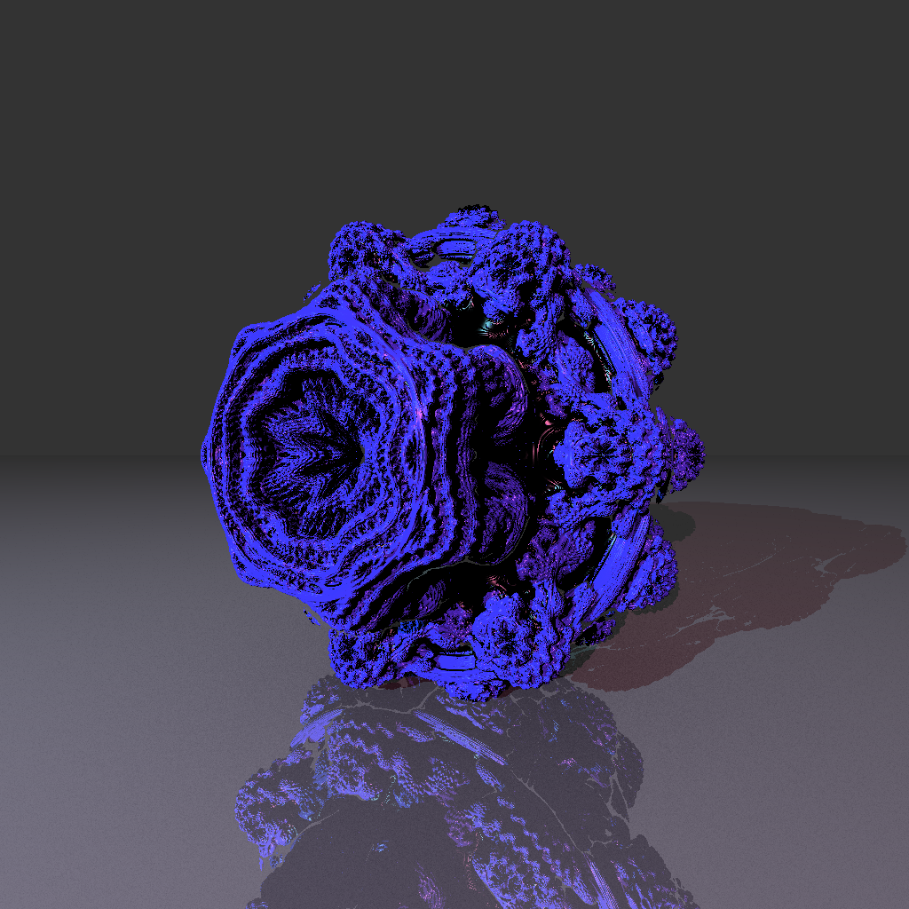
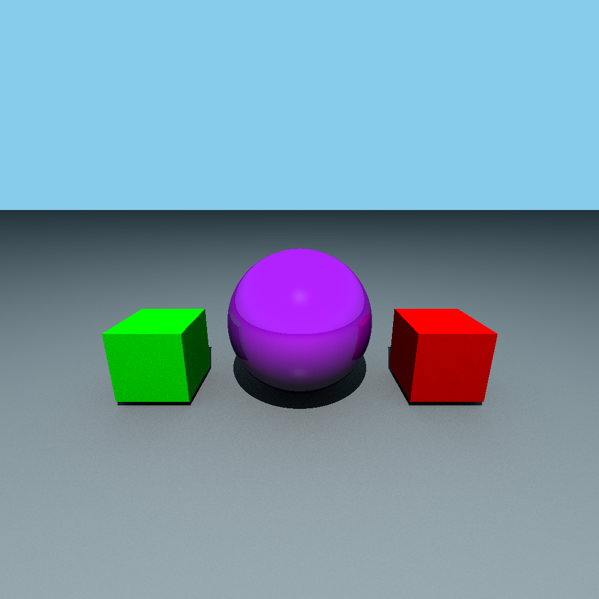
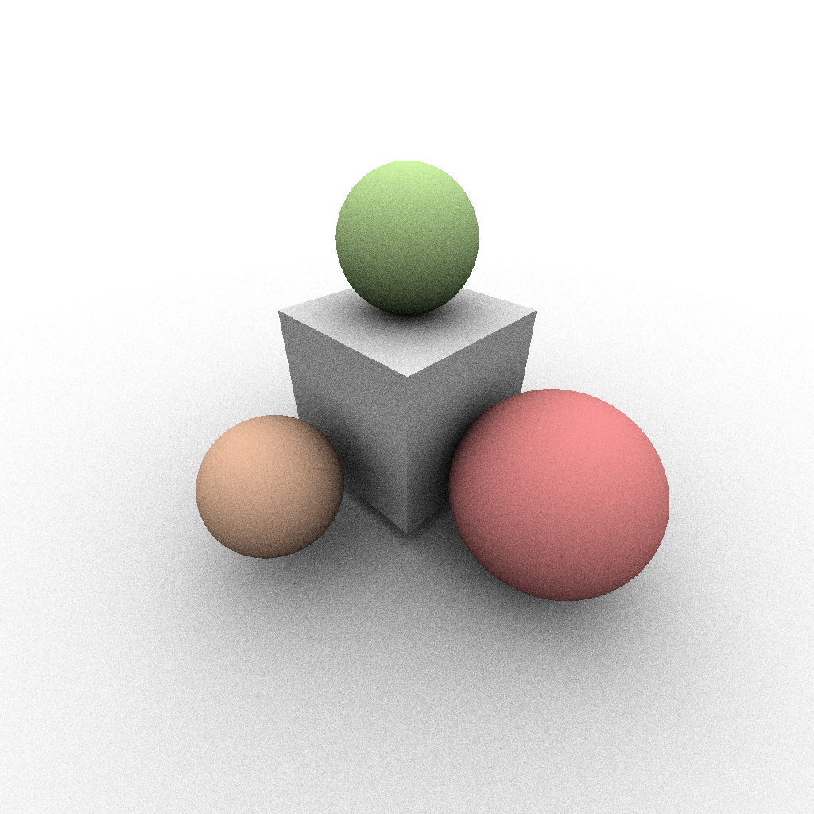
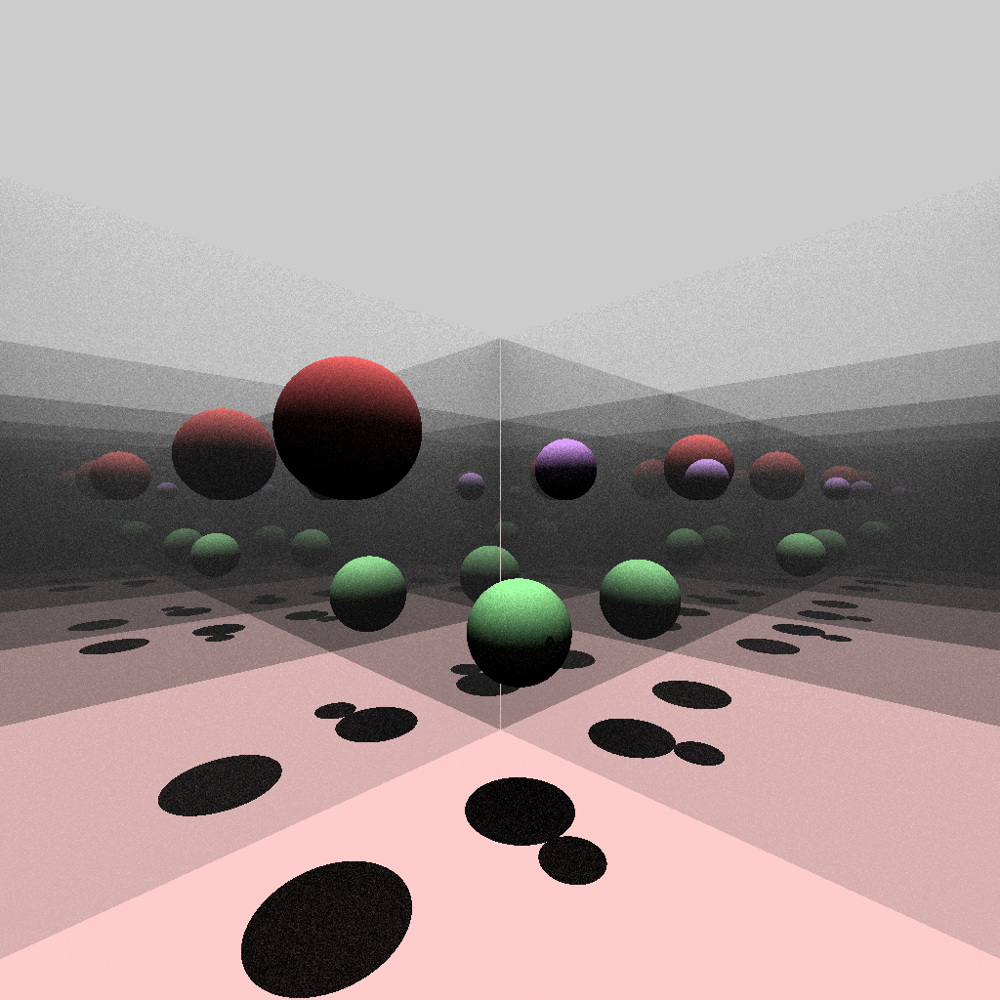
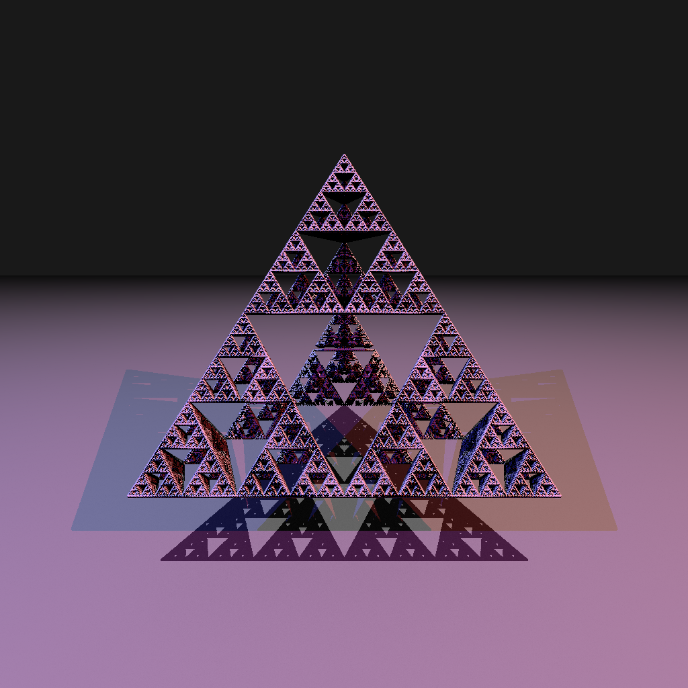
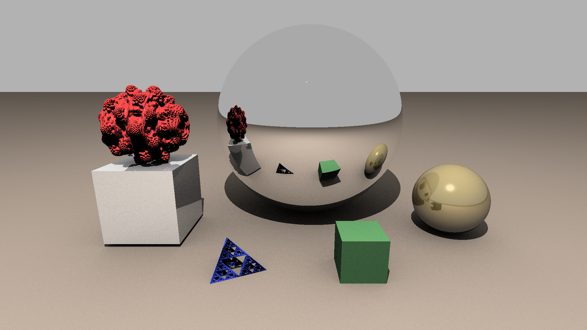

# RayTracingEngine

Консольное приложение для рендеринга 3Д моделей

<div style="display: flex">
  
  
  
</div>
<div style="display: flex">
  
  
</div>



Поддерживаются 

3 примитива:

*   Куб
*   Плоскость
*   Сфера

2 фрактала:

*   Mundelbulb
*   Треугольник Серпинского

Инструкция для запуска:

комплияция либо через 

```
make build
```

либо

```
g++ main.cpp scene.h custom_utils.h public_image.h objects.h input.h LiteMath.h stb_image_write.h stb_image.h -o main
```

Запуск программы:

```
./main
```

Аргументы:

\-c, --const - настроить константы вычисления

\-h, --help

Формат входных данных приведен в samples/input\_samples.txt:

---

spheres count - количество сфер

для каждой сферы нужно указать ее параметры:  
   sphere pos - координаты центра  
   sphere radius - радиус  
   Material - параметры материала  
       color - цвет (0-1, 0-1, 0-1)  
       ambient \[0-1\]  
       reflection \[0-1\]  
       specular \[0-1\]  
       reflect\_power \[0, 1, 2, 3, 4, ...\]

---

boxes count - количество боксов

для каждого:  
   pos - координаты центра  
   size - размеры (вектор из 3 значений)  
   Material  
       color  
       ambient  
       reflection  
       specular  
       reflect\_power

---

planes count - количество плоскостей  
   direction - нормаль  
   height - расстояние от центра координат  
   Material  
       color  
       ambient  
       reflection  
       specular  
       reflect\_power

---

fractals count - количество фракталов  
   type - тип фрактала (1 - Mundelbulb, 2 - треугольник серпинского)  
   1:  
       position - координаты  
       iterations - количество итераций при вычислении  
       power - степень в формуле z = z^n + c  
       Material  
           color  
           ambient  
           reflection  
           specular  
           reflect\_power  
   2:  
       position - координаты  
       iterations - количество итераций  
       Material  
           color  
           ambient  
           reflection  
           specular  
           reflect\_power

---

light sources count - количество источников света  
   position - позиция  
   power - мощность света  
   color - цвет света

---

camera pos - позиция камеры  
camera dir - направление камеры

---

Константы вычисления (если был введен соответствующий аргумент командной строки)

MIN\_DIST - минимальный порог дистанции при реймарчинге  
MAX\_DIST - максимальная дистанция при реймарчинге  
ITER\_MAX - максимальное количество итераций реймарчинга

IMAGE\_WIDTH - ширина выходной картинки  
IMAGE\_HEIGHT - высота выходной картинки  
FOV\_H - угол обзора по горизонтали  
FOV\_V - угол обзора по вертикали  
 

EPS - точность вычислений  
REFLECT\_ITERATIONS - количество переотражений при рейтрейсинге  
DIFFUSE\_RAYS\_COUNT - количество лучей при вычислении Ambient Occlusion  
BACKGROUND\_COLOR - цвет заднего плана (0-1, 0-1, 0-1)

---

Есть возможность посмотреть 6 примеров сцен, они хранятся в папке samples.

Там же хранятся уже отрендеренные картинки сцен.

Для вывода конкретной сцены из примеров нужно запустить программу с аргументом -c и перенаправить поток ввода из соответствующего файла, например:

```
./main -c < samples/input1.txt
```


Результат сохраняется в картинке out.png
